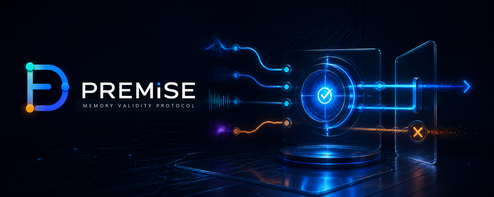

<div align="center">

# Dafenx

### I build tools that make AI agents easier to trust.

I work where agents meet reality: proving whether a skill helps, keeping
decisions coherent while sources change, and designing software that recovers
cleanly when the happy path ends.

[](https://github.com/Dafenxz0/premise-protocol)
[](https://github.com/Dafenxz0/skillproof)
[](https://github.com/Dafenxz0/statecraft-skill)
[](https://github.com/Dafenxz0?tab=repositories)

<sub>Agent evaluation · mutable-state safety · resilient interfaces · emulation · developer tooling</sub>

</div>

---

## Selected projects

### [SkillProof](https://github.com/Dafenxz0/skillproof)

> **Prove your Agent Skill works before you publish it.**

A dependency-free CLI and companion Agent Skill for comparing clean baselines,
automatic availability and forced skill use across real models. It records
quality, regressions, tokens, cost and latency, then produces reviewable JSON,
HTML and repository evidence.

[](https://github.com/Dafenxz0/skillproof/blob/main/benchmarks/self/latest/report.html)

<details>
<summary><strong>Why it exists</strong></summary>
<br>

Anyone can publish a `SKILL.md` and say that it helps. SkillProof asks whether
the result actually improved, whether the improvement survives another model,
what it costs and whether a later edit caused a regression.

</details>

### [PREMiSE](https://github.com/Dafenxz0/premise-protocol)

> **Change control for AI agents working against a world that keeps changing.**

<a href="https://github.com/Dafenxz0/premise-protocol">
  
</a>

PREMiSE is a coherence protocol and TypeScript runtime for decisions that depend
on mutable external state. It records the evidence and version behind a decision,
revalidates at the action boundary, and fails closed when the source changed or
cannot be checked with enough authority.

| Ordinary memory | PREMiSE |
| --- | --- |
| Can preserve `config@v41` perfectly after the source moved to `config@v42`. | Carries source identity, versions and dependencies to a final guard before the side effect. |
| Remembers an observation. | Checks whether the observation is still usable. |
| May discover the change after wasted work or an unsafe attempt. | Revalidates, blocks or lets the connector perform its own conditional write. |

<p>
  <a href="https://github.com/Dafenxz0/premise-protocol"></a>
  <a href="https://github.com/Dafenxz0/premise-protocol/blob/main/README.md#what-is-measured"></a>
  <a href="https://github.com/Dafenxz0/premise-protocol/blob/main/docs/agent-installation.md"></a>
</p>

### [Statecraft](https://github.com/Dafenxz0/statecraft-skill)

> **The happy path is a demo. Recovery is the product.**

An Agent Skill for building complete user interfaces around loading, empty,
offline, stale, partial, conflict, permission, retry and success states. It
helps turn a polished screen into something people can rely on when reality
gets messy.

```text
request → waiting → partial data → failure → recovery → continuity
```

---

## More tools

| Project | What it is for |
| --- | --- |
| [healthcheck](https://github.com/Dafenxz0/healthcheck) | Audit repository health, contribution activity, release readiness and maintainer hygiene from a small CLI. |
| [codex-maintainer-skills](https://github.com/Dafenxz0/codex-maintainer-skills) | Compact workflows that help coding agents contribute to open source with tighter scope and better evidence. |
| [Pando](https://github.com/Dafenxz0/pando) | Multi-repository coding-agent orchestration through an explicit SPEC → PLAN → TEST → IMPLEMENT → REVIEW → PR pipeline. |
| [Forgeboard](https://github.com/Dafenxz0/forgeboard) | A local-first operations dashboard for open-source maintainers. |

---

## Open-source systems work

| Area | What I contribute |
| --- | --- |
| [SharpEmu](https://github.com/par274/sharpemu/pulls?q=is%3Apr+author%3ADafenxz0) | Focused C# and Vulkan work around resource lifetime, scheduling boundaries, pipeline validation, diagnostics and regression safety. |
| [KytyPS5](https://github.com/KytyPS5/KytyPS5/pulls?q=is%3Apr+author%3ADafenxz0) | Portable Vulkan tests, CMake/CTest integration and fixes that behave consistently across GPU drivers. |

I prefer changes that are small enough to review, important enough to matter,
and backed by a test, a trace or a concrete explanation.

---

## Working principles

```text
Measure the claim.       Keep the evidence.
Model the change.        Guard the action.
Design the failure.      Make recovery obvious.
```

- Practical tools over impressive demos.
- Reproducible evidence over inflated claims.
- Explicit boundaries over hidden magic.
- Real failure cases over happy-path screenshots.

## Toolbox

<p>
  
  
  
  
  
  
  
  
</p>

---

## Activity

<div align="center">

[](https://github.com/Dafenxz0)

<a href="https://github.com/Dafenxz0?tab=followers">
  
</a>
<a href="https://github.com/Dafenxz0?tab=repositories">
  
</a>

</div>

---

<div align="center">

### Building in public. Testing the uncomfortable cases.

[Explore PREMiSE](https://github.com/Dafenxz0/premise-protocol) ·
[Try SkillProof](https://github.com/Dafenxz0/skillproof) ·
[Read Statecraft](https://github.com/Dafenxz0/statecraft-skill) ·
[See every project](https://github.com/Dafenxz0?tab=repositories)

</div>
